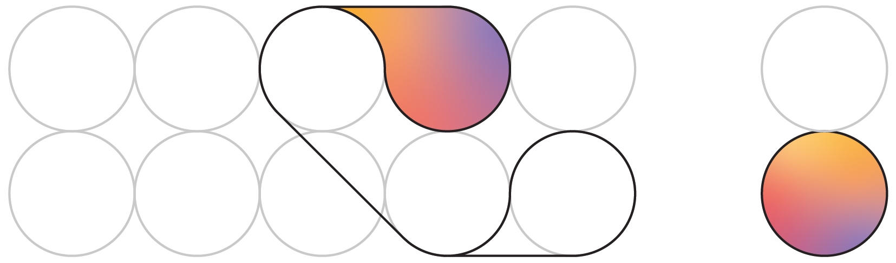

# AI Agent Hackathon x Digital Energy Grid

<!-- <p align="center">
  
</p>  -->

<p align="center">
  
</p>


# Haikara 

### Team Members  
Sofie Rüffer  
Kamila Bereket  
Adeline Wong  
Rucha Agashe  
Rana Rustamli  


<br>

## Introduction

Haikara is a multi-agent orchestration system built for the DEG Hackathon. It coordinates four specialized agents to optimize when data center workloads run, scheduling them during times of low energy prices and carbon intensity while participating in P415 flexibility programs.

**Key Results:**
- 15-20% cost reduction (£350-400 per cycle)
- 20-40% carbon emission reduction (200-500 kg CO2)
- P415 flexibility revenue generation

<br>

## How It Works

The system uses four agents that work together:

1. **Compute Agent** - Manages workload data (jobs, energy usage, SLA deadlines)
2. **Grid Agent** - Fetches real-time energy prices and carbon intensity data
3. **Decision Agent** - Runs optimization algorithms to schedule workloads optimally
4. **Audit Agent** - Creates cryptographic audit trail of all decisions

The **Orchestrator** coordinates these agents through the complete Beckn protocol workflow:

- **Discovery Phase**: `search` - Find optimal energy windows
- **Order Phase**: `select`, `init`, `confirm` - Book energy capacity
- **Fulfillment Phase**: `status`, `update` - Monitor execution
- **Post-Fulfillment Phase**: `rating` - Submit settlement data

All API calls go through the BAP Sandbox as required by Beckn protocol.

<br>

## Installation & Running

**Install dependencies:**
```bash
pip install ...
```

**Run web dashboard:**
```bash
python app.py
```
Then open http://...

**Or run command-line:**
```bash
python main.py
```

<br>

## Repository Structure

```
haikara-agent/
├── app.py                  # Web dashboard server
├── main.py                 # Command-line interface
├── orchestrator.py         # Coordinates all agents
├── compute_agent.py        # Workload management agent
├── grid_agent.py           # Energy signals agent
├── decision_agent.py       # Optimization agent
├── audit_agent.py          # Audit trail agent
├── beckn_client.py         # Beckn protocol API client
├── models.py               # Data structures
├── config.env              # Configuration file
├── requirements.txt        # Python dependencies
└── templates/
    └── dashboard.html      # Web UI
```

<p align="center">
  
  
</p>

